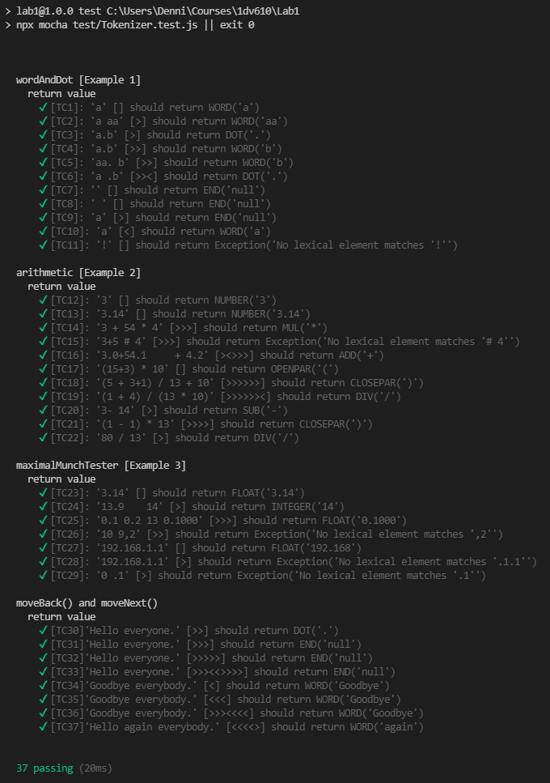

# Mall för inlämning laboration 1, 1dv610

## Checklista
  - [x] I min tokeniserare finns inga tokentyper eller reg-exp. Dessa finns i mitt testprojekt eftersom de skapas utav användaren.
  - [x] Jag har skrivit all kod och reflektioner själv. Jag har inte använt mig av andras kod för att lösa uppgiften.
  - [x] Mina testresultat är skrivna utifrån utförd testning ( och inte teoretiskt, det bör fungera :) )
  - [x] De enda statiska metoder eller funktioner utanför klasser som jag har är för att starta upp min testapplikation ex main(java).
  - [x] De enda bibliotek och färdiga klasser som används är sådana som måste användas (eller som används för att testa modulen).

## Egenskattning och mål
  - [ ] Jag är inte klar eftersom jag vet att jag saknar något. Då skall du inte lämna in!
  - [ ] Jag eftersträvar med denna inlämning godkänt betyg (E-D)
    - [x] De flesta testfall fungerar
    - [x] Koden är förberedd på Återanvändning
    - [x] All kod samt historik finns i git 
    - [x] Kodkvaliterskraven är ifyllda
    - [x] Reflektion är skriven
  - [x] Jag eftersträvar med denna inlämning högre betyg (C-B) och anser mig uppfylla alla extra krav för detta. 
    - [x] Samtliga testfall är skrivna
    - [x] Egna testfall för Maximal munch och kantfall
    - [x] Testfall är automatiserade
    - [x] Det finns en tydlig beskrivning i hur modulen skall användas (i git)
    - [x] Kodkvalitetskraven är varierade 
  - [ ] Jag eftersträvar med denna inlämning högsta betyg (A) 

Förtydligande: Examinator kommer sätta betyg oberoende på vad ni anser. 

## Återanvändning
Instruktioner/Beskrivning av tokeniseraren används finns skrivet på engelska i repositoriets [README](./README.md).

Exempel för instantieringen av en ny tokeniserare

```js
// Example app.js
import Tokenizer from '{directory}'

// Grammar example
const wordAndDotGrammar = [
  { name: 'WORD', regex: /^[a-zA-Z|åäöÅÄÖ]+/ },
  { name: 'DOT', regex: /^\./ }
]

const tokenizer = new Tokenizer(wordAndDotGrammar, 'Meningen består av ord')

console.log(tokenizer.getActiveToken())
```
Resultat: `{ type: 'WORD', value: 'Meningen' }`

I [README](./README.md) finns beskrivning över hur en grammatik är uppbygd och vilka regler som gäller för de reguljära uttrycken.
## Beskrivning av min kod
_Nedanstående beskrivning finns även att läsa på engelska i [README](./README.md)._

Tokeniseraren består av två klasser, huvudklassen `Tokenizer` och underklassen `Token`.

### Tokenizer(grammar[], string)
En ny tokeniserare instantieras med en tilldelad grammatik och en sträng att analysera. Grammatiken förväntas vara en array som består av objekt som representerar token-typer. En token-typ ska ha ett specifierat namn (`name`) och ett reguljärt uttryck (`regex`). När tokenizer-objektet skapas börjar tokeniseringen av strängen direkt och nedanstående metoder används för att observera resultatet.

#### getTokens()
Returnerar en array av alla Token objekt. Finns mest för troubleshooting-syfte

Exempel på return: `[{ type: 'WORD', value: 'Hej'}, { type: 'DOT', value: '.'}, { type: 'END', value: null}]`

#### getActiveToken()
Returnerar det token som är 'aktivt'. I en o-manipulerad lista är det första tokenet (index 0) aktivt.

Exempel på return: `{ type: 'WORD', value: 'Exempel' }`

#### moveNext()
Flyttar 'pekaren' för det aktiva tokenet framåt. Går att medföra en integer i argumentet för att specifiera mängden steg som önskas flytta.

Exempel på användning
```js
tokenizer.moveNext() // Flytta aktiva token-pekaren 1 steg framåt.

tokenizer.moveNext(8) // Flytta pekaren 8 steg framåt på en gång.
```
#### moveBack()
Flyttar 'pekaren' för det aktiva tokenet bakåt. Går att medföra en integer i argumentet för att specifiera mängden steg som önskas flytta.

Exempel på användning
```js
tokenizer.moveBack() // Flytta aktiva token-pekaren 1 steg bakåt.

tokenizer.moveBack(3) // Flytta pekaren 3 steg bakåt på en gång.
```
### Token
Ett token som resulterat från tokeniseringen av en sträng. Har en typ (`type`) och ett värde (`value`)

#### hasMoreMatchedCharactersThan(otherToken)
Jämför längden i karaktärer med ett annat medfört token. 

Returnerar `true` ifall det medförda tokenet är kortare, `false` då det medförda tokenet är längre.

## Hur jag testat
Under utvecklingen har tokeniseraren testats med automatiska tester framtagna med testramverken [Mocha](https://www.npmjs.com/package/mocha) och [Chai](https://www.npmjs.com/package/chai). 

Jag har också skrivit en testapp som finns tillgänglig för att utföra manuell testning. Starta denna testapp genom `npm run testapp`

### Testfall

| Namn      | Grammatik | Sträng | Sekvens | Förväntat Aktivt Token | PASS/FAIL |
| --------- | --------- | ------ | ------- | ------------ | --------- |
| TC1          | wordAndDot      | 'a'       |[]         |WORD('a')| PASS          |
| TC2          | wordAndDot          | 'a aa'       | [>]        |WORD('aa')|PASS|
| TC3          | wordAndDot          | 'a.b'       | [>]        |DOT('.')|PASS|
| TC4          | wordAndDot          | 'a.b'       |  [>>]       |**WORD('b')**|PASS|
| TC5          | wordAndDot          | 'aa. b'       | **[>>]**        |WORD('b')|PASS|
| TC6          | wordAndDot          | 'a .b'       | [>><]        |DOT('.')|PASS|
| TC7          | wordAndDot          | ''       |  []       |END('null')|PASS|
| TC8          | wordAndDot          | ' '       |  []       |**END('null')**|PASS|
| TC9          | wordAndDot          | 'a'       |  **[>]**       |END('null')|PASS|
| TC10          | wordAndDot          | 'a'       |  [<]       |**WORD('a')**|PASS|
| TC11          | wordAndDot          | '!'       |  []       |Exception|PASS|
| TC12          | arithmetic          | '3'       |  []       |NUMBER('3')|PASS|
| TC13          | arithmetic          | '3.14'       | []        |NUMBER('3.14')|PASS|
| TC14          | arithmetic          | '3 + 54 * 4'       | [>>>]        |MUL('\*')|PASS|
| TC15          | arithmetic          | '3+5 # 4'       |  [>>>]       |**Exception**|PASS|
| TC16          | arithmetic          | 3.0+54.1       |  [><>>>]       |**ADD('+')**|PASS| 

### Testfall för högre betyg

Lista de enskilda testfallen. En rad per testfall.
| Namn      | Grammatik | Sträng | Sekvens | Förväntat Aktivt Token | PASS/FAIL |
| --------- | --------- | ------ | ------- | ------------ | --------- |
| TC17          | arithmetic          | '(15+3) * 10'       | []        |OPENPAR('(')|PASS|
| TC18          | arithmetic          | '(5 + 3+1) / 13 + 10'       |[>>>>>>]         |CLOSEPAR(')')|PASS|
| TC19          | arithmetic          | '(1 + 4) / (13 * 10)'       | [>>>>>><]        |DIV('/')|PASS|
| TC20          | arithmetic          | '3- 14'       | [>]        |SUB('-')|PASS|
| TC21          | arithmetic          | '(1 - 1) * 13'       |[>>>>]         |CLOSEPAR(')')|PASS|
| TC22          | arithmetic          | '80 / 13'       |[>]         |DIV('/')|PASS|
| TC23          | maximalMunchExample          | '3.14'       |[]         |FLOAT('3.14')|PASS|
| TC24          | maximalMunchExample          | '13.9    14'       |[>]         |INTEGER('14')|PASS|
| TC25          | maximalMunchExample          | '0.1 0.2 13 0.1000'       |[>>>]         |FLOAT('0.1000')|PASS|
| TC26          | maximalMunchExample          | '10 9,2'       |[>>]         |Exception|PASS|
| TC27          | maximalMunchExample          | '192.168.1.1'       |[]         |FLOAT('192.168')|PASS|
| TC28          | maximalMunchExample          | '192.168.1.1'       |[>]         |Exception|PASS|
| TC29          | maximalMunchExample          | '0 .1'       |[>]         |Exception|PASS|
| TC30 - Mover Methods         | wordAndDot          | 'Hello everyone.'       |[>>]         |DOT('.')|PASS|
| TC31 - Mover Methods         | wordAndDot          | 'Hello everyone.'       | [>>>]        |END('null')|PASS|
| TC32 - Mover Methods         | wordAndDot          | 'Hello everyone.'       | [>>>>>]        |END('null')|PASS|
| TC33 - Mover Methods         | wordAndDot          | 'Hello everyone.'       | [>>><<>>>>]        |END('null')|PASS|
| TC34 - Mover Methods         | wordAndDot          | 'Goodbye everybody.'       |[<]         |WORD('Goodbye')|PASS|
| TC35 - Mover Methods         | wordAndDot          | 'Goodbye everybody.'       | [<<<]        |WORD('Goodbye')|PASS|
| TC36 - Mover Methods         | wordAndDot          | 'Goodbye everybody.'       |  [>>><<<<]       |WORD('Goodbye')|PASS|
| TC37 - Mover Methods         | wordAndDot          | 'Hello again everybody.'       |  [<<<<>]       |WORD('again')|PASS|

### Resultat från automatiska tester


## Kodkvalitetskrav

### Namngivning

`getActiveToken()` Metodnamn på metod som returnerar det token som just nu är aktivt.

- **Method Names** - Namnet inkluderar ett verb (get). Metoden är enbart tänkt att hämta ett värde och returnera till användaren. 

`Token` Klassnamn på klass i modulen som representerar en nedbruten bit av en sträng.

- **Class Names** - Hela metodnamnet är ett substantiv.
- **Don't be Cute** - Namnet försöker inte vara listigt på något vis


`Token.hasMoreMatchedCharactersThan(otherToken)` Metodnamn på metod som jämför två tokens baserat på maximal-munch regeln

- **Method Names** - 'Has' tyder på att funktioner returnerar ett boolskt värde. 
- **Use Solution Domain Names** - Trots att regeln vi är ute efter att applicera är maximal munch så är ett namn från 'lösningsdomänen' mer passande.
- **Use Pronounceable Names** - Namnet må vara långt, men det är lätt att uttala.

Alternativt 'hasMoreMatchedCharsThan' eller 'hasMoreMatchedChars' kortar ner namnet utan att göra uttalet mycket värre eller försämra förståelsen.

`moveNext()` Metodnamn på metod som flyttar pekaren för det aktiva tokenet framåt

- **Use Intention-Revealing Names** - Metodnamnet tyder på att någonting flyttas, men inte alls _vad_ som flyttas.
- **Add Meaningful Context** - Något sammanhang behövs för att berätta vad det är vi flyttar på när vi kallar på metoden.

Alternativt 'moveActiveTokenPointerForward' eller 'moveActiveTokenPointerToNextToken' för att förtydliga att det är den aktiva-token pekaren vi flyttar på.

`getTokens()`  Metodnamn på metod som returnerar alla tokens som just nu finns i tokenlistan (mest för troubleshooting)

- **Method Names** - 'Get' tyder på att metoden är en accessor av något slag, vilket stämmer.

### Funktioner

`_startTokenization()` Metod som sköter tokenisering av strängen med hjälp av andra privata metoder

- **Small!** - Metoden är jämförelsevis stor då den hanterar mycket av tokenisering-logiken. Borträknat whitespace är den 15 rader lång.
- **Do One Thing** - Metoden ansvarar för mer än en sak. Den sköter felhantering och kastandet/fångandet av undantag samtidigt som den hanterar tokenisering-logiken. Metoden borde helst brytas ned till fler, mindre, metoder.

Metoden kan istället heta '_tokenize()' då den gör mer än att bara starta tokeniseringen, men egentligen borde den brytas ned i mindre bitar.

`_matchStringToAllKnownTokenTypes(types)` Metod som testar att matcha strängen mot alla regex tokeniseraren har, returnerar lyckade matchningar 

- **Function Argument** - Metoden har endast ett argument(**monadic**)  
- **Do One Thing** - Metoden gör egentligen två saker, [1] Den matchar strängen mot alla kända regex [2] Returnerar lyckade matchningar. Egentligen går det separera logiken till två metoder.
- **Use Descriptive Names** - Det finns inget i namnet som tyder på att metoden returnerar något.

En ny metod kan brytas bort som ansvarar för att returnera de matchade tokens, till exempel med namnet getAllMatchedTokens()

`_getTokenWithMostCharacters(tokens)` Metod som jämför alla matchade token-värden med varandra, returnerar det token med längst värde

- **Function Argument** - Metoden har endast ett argument(**monadic**)   
- **Don't Pun** (Från kapitel 2) - Det finns enkla accessorer i modulen som använder prefixet 'get'. Denna metoden är ingen accessor då den hanterar logik för att jämföra karaktär-längden av olika tokens och returnera det längsta tokenet.

Metoden kan istället ändra 'get'-prefixet till ett annat alternativ, exempelvis 'retrieve' eller 'obtain'. Alternativt kan metoden brytas ned i fler, mindre, metoder.

`moveNext()` Metodnamn på metod som flyttar pekaren för det aktiva tokenet framåt

- **Do One Thing** - Metoden hanterar också logik för ifall rörelsen av pekaren är 'tillåten', exempelvis flytta förbi slutet av listan eller innan början av listan. Denna logiken kan brytas ut.

_Alternativ från innan:_ 'moveActiveTokenPointerForward' eller 'moveActiveTokenPointerToNextToken'

`_matchStringAgainstRegex(regex)` Metodnamn på metod som matchar tokeniserarens sträng mot ett tilldelat regex. Returnerar den delen av strängen som matchar.

- **Do One Thing** - Metoden är kort och enkel.
- **Use Descriptive Names** - Det finns inget i namnet som tyder på att metoden returnerar något.

Alternativt 'retrieveTokenValueFromMatchingStringAgainstRegex(regex)' för att förtydliga att metoden returnerar ett token-värde.

## Laborationsreflektion
Jag tycker att laborationen har gett mig en bra inblick i vad jag kan göra för att förbättra kodkvalitén på det jag producerar. Det har många gånger tagit mig lång tid att välja namn på metoder, men den tiden har jag sparat flera gånger om på hur mycket snabbare jag kan få tillbaka “förståelsen” av modulen efter en paus.

Jag har arbetat på att vara noggrannare med uttalbara namn under laborationen, boken lyfter fram vikten av att kunna uttala namn för att underlätta diskussion, men även i enskilt arbete har jag märkt att det är lättare att hålla koll på logiken i huvudet ifall det man ska ha koll på är uttalbart.

Till en början kändes det väldigt främmande med användningen av långa namn. För mig har det alltid varit naturligt med korta namn, och sedan en lång kommentar. Nu har jag istället lagt vikten på att hitta på ett långt och beskrivande namn, då slipper man kommentaren helt och hållet.

Flera gånger när jag har försökt hitta på ett bra namn till en metod så har det lett till bra omstrukturering av koden i syftet att kunna skriva sanningsenliga namn som faktiskt gör vad de säger.

Överlag tycker jag att laborationen har lärt mig att ta kodkvalité på mer allvar. Dessutom har uppgiften gett en bra möjlighet att öva på de “verktyg” och arbetsmetoder som lyfts fram i boken. Att ta noga hänsyn till att en annan person kan behöva förstå koden har också varit, enligt mig, väldigt givande.
